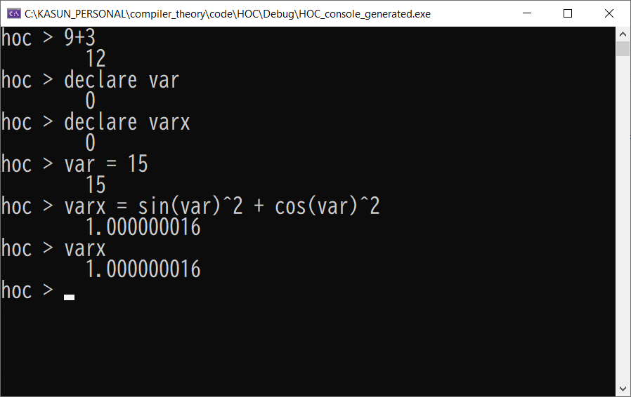

# HOC
**Higher Order Calculator with flex and bison.**

Orginal concept for this project is based on that in The **Unix Programming Environment** by **Brian Kernighan** and **Rob Pike**.

**Features.**
- Common mathamtical operators ( +, - , *, /,  ^(power))
- User can utilize existing functions like **sin, cos, tan, sqrt, log, exp**. These functions take single double value argument and result of function call is similar to that in the C specificaiton. 
- User can input one line of statement at once.
- After each input line, statement value will be printed to console.
- Internally all the values handle as **double**
- Does not allow user to define new functions. Can only use exsisting functions.
- User can define variable using **declare var_name** construct to persist the values for later use. 
- Type **quit** to exist the program. 
- Variable name can only be alpha. 

**Implementation details**
- **Symbol table** has implemented using **std::map struncture** and functions (sin, cos etc:) are added to the map in main.c
- Function are internelly called to corresponding function pointers in **cmath.h** header.

**Improvements**
- User define functions, and more than one argument functions.
- Multi type variable support.
- Memory optimizations / avoid creating duplicate objects etc.

**Examples syntax**
> 9+3

> declare var

> declare varx

> var = 15

> varx = sin(var)^2 + cos(var)^2

**Screen shot**

